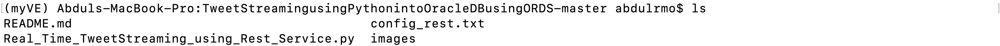
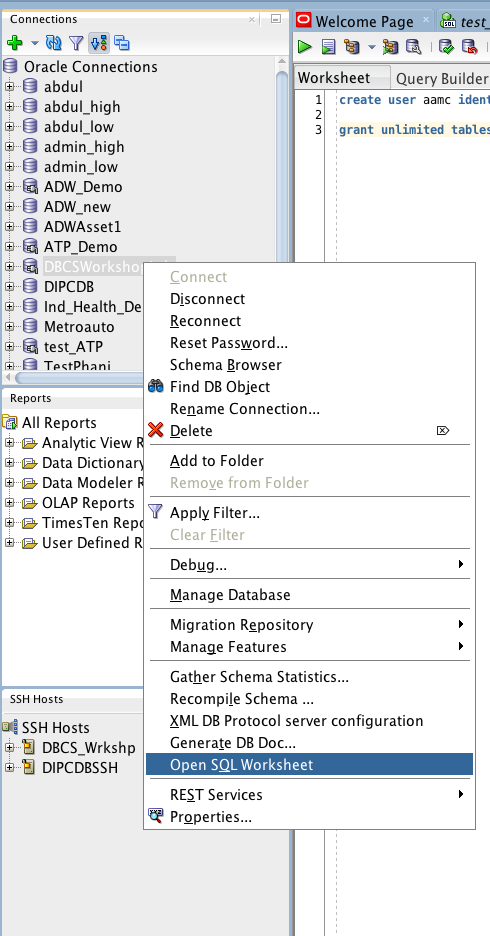
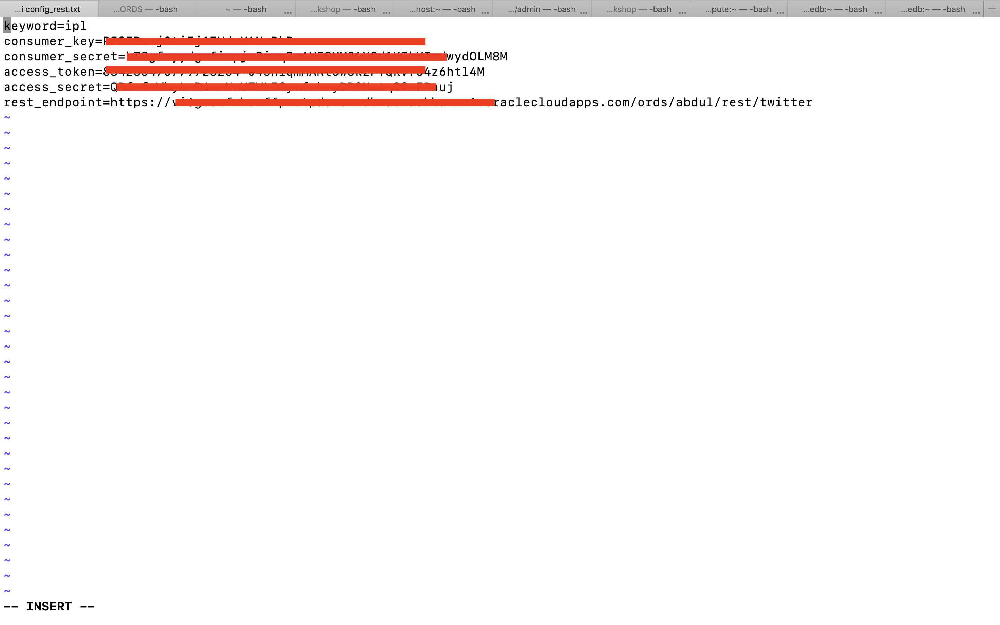
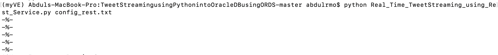
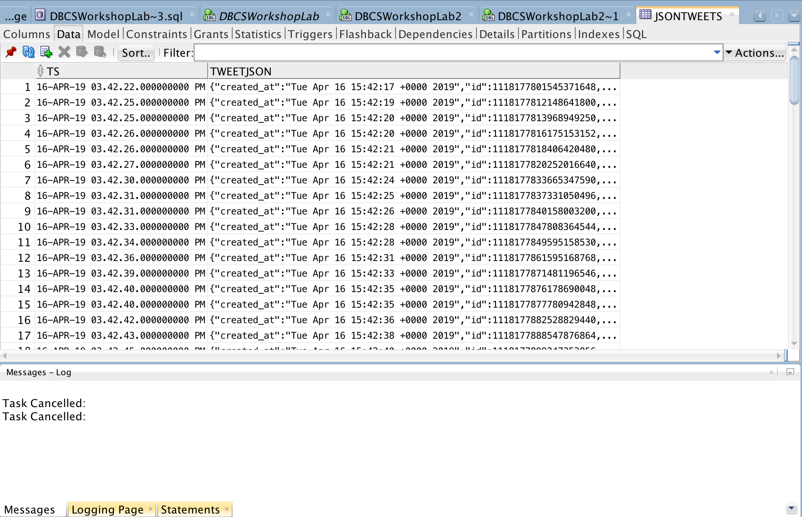

<table class="tbl-heading"><tr><td class="td-logo">[](README.md)

Last Updated:<br>November 06, 2019
</td>
<td class="td-banner">
# Guide 2 : Using the REST Service on Oracle ATP to load data from Python Application to Oracle ATP
</td></tr><table>

## Introduction

In this guide , you will be installing a python application and using the REST service you created in the previous guide  to load data into the Oracle Database you created in Guide 1.

You can load data into Oracle Database by multiple methods but REST service provides ease of use for the developer and is easily integratable with most of the applications.

You can load data:
- By creating connection to database in the application.
- By using REST service created on Oracle Database.

This guide  shows how to integrate the REST service with the Python application and use it to load data from Python Application to Oracle Database.

To **log issues**, click [here](https://github.com/Abdul-Rafae-Mohammed/StepByStepGuideToSetupPythonAppWithOracleATP/issues/new) to go to the github oracle repository issue submission form.

## Objectives

- Learn how to use the REST service on ATP database and integrate them with the applications.
- Verify the data being loaded in the database using SQL Developer

## Required Artifacts

- Please ensure you completed the guide 1 before you start this guide . Refer <a href="./Guide100Create_a_RestService_on_ATP.md" target="_blank">Guide1.md</a>

- You have installed Oracle SQL Developer. You can download SQL Developer 18.3 [here](https://www.oracle.com/technetwork/developer-tools/sql-developer/downloads/index.html) and follow the instructions to complete the installation.

- You should have docker installed on the machine/computer on which you want to deploy the application. Learn more about installing and using Docker by viewing this [website](https://docs.docker.com/install/)

- For getting the twitter authentication details, you need to have a twitter account and create an app on twitter from which the python application can retrieve tweets. To setup your twitter account please follow the steps on this <a href="https://docs.inboundnow.com/guide/create-twitter-application/" target="_blank">link</a>.

## Steps

### **STEP 1: Setup the environment for the Python Application**

**STEP 1.1: Clone the docker file from github**

    - Now, we are going to setup the environment for the application we are going to integrate with the database. Here we are going to use docker to utilize the benfits of a Microservices architecture.
    - Replicate the docker file from <a href="./Guide100Create_a_RestService_on_ATP.md" target="_blank">this</a> repository.

    - Before that navigate to the folder where you want to download the application or create a new folder and navigate to it.
    - Create a directory for the application, lets say "APPTwitter".

    ```
    mkdir /APPTwitter
    ```
    - Move to that directory

    ```
    cd /APPTwitter
    ```
    - Clone the Github Repository by executing this command on your terminal window.

    ```
    git clone https://github.com/Abdul-Rafae-Mohammed/Deploying-Python-TweetStreamingApp-as-a-Microservice.git
    ```
    
    - Go inside the Deploying-Python-TweetStreamingApp-as-a-Microservice Directory

    ```
    cd Deploying-Python-TweetStreamingApp-as-a-Microservice
    ```
    
    - Make Sure Docker Application on your machine is started. and is up and running.

    - If you have any existing docker images you can remove it by running the following commands:  

    ```
    docker rm -f $(docker ps -a -q)

    docker rmi -f $(docker images -q)
    ```
    
    - Build the docker image by run the following command 

    ```
    docker build -t twitter .
    ```

    - Deploy and run the application by using the following command 

    ```
    docker run -i -p 3050:3050 -t twitter sh
    ```

    - Go inside the docker image directory
    ```
    cd TweetStreamingusingPythonintoOracleDBusingORDS
    ```

    You will see:
    - Python Application: **Real_Time_TweetStreaming_using_Rest_Service.py**
    - Config file: **config_rest.txt**

    

**STEP 1.2: Setup the database for the Python Application(Optional)**

    - This step is optional.
    - This step is only required if you do not have the database setup already.
    - Follow the below steps to setup the database.

        **Creating Users and Tables for the users in DBCS**

        Now, connect to the provisioned ATP instance using SQL Developer or SQL Client. We will now create a user and create a table to load JSON data into it by connecting to ATP as ADMIN user.

        - Right click DB connection on the connections panel in SQl Developer.

            

        - Click on new **Open SQl Worksheet** option. A new worksheet will be opened.

        - Execute the below SQL commands to create user and table in that schema.

            ```
            create user <SchameName> identified by WElCome12_34#;
            alter user <SchameName> quota unlimited on data;
            grant connect, resource to <SchemaName>;
            ```

            ```
            CREATE TABLE <schema>.JsonTweets (ts TIMESTAMP,TWEETJSON CLOB CONSTRAINT check_json CHECK (TWEETJSON IS JSON));
            ```

            ```
            ALTER TABLE <schema>.jsontweets ADD CONSTRAINT check_nn CHECK (TWEETJSON IS not null);
            ```

        - Now, you have setup the schema and the tables.

### **STEP 2: Setting up the configuration file for the Python App**

- The Python Application you installed is going to download the tweets from twitter based on the keyword you provide and store them in JSON format in the Oracle Database you created in Guide 1.

- Since, JSON is natively supported by the Oracle Database. You dont have to worry about reformatting the JSON object or parsing the JSON object to extract the data and then store it. You can directly store the JSON objects in the Oracle database.


- Now, Modify the application config to work with your environment.

- Navigate to the folder where you have unzipped the application.

- open the config file

    ```
    vi config_rest.txt
    ```

- change all the parameters based on your environment.

    ```
    keyword=<Keyword>
    consumer_key=<Twitter Account Consumer Key>
    consumer_secret=<Twitter Account Consumer Secret>
    access_token=<Twitter Account Access Token>
    access_secret=<Twitter Account Access Secret>
    rest_endpoint=<REST End Point Full URL>
    ```

    

### **STEP 3: Running the Python App**

- Make sure you are in the folder with the Python App.

- Run the Python App.

    ```
    python Real_Time_TweetStreaming_using_Rest_Service.py config_rest.txt
    ```


- Verify the script output. the Application is going to print a "-%-" on screen each time a tweet is being stored in the database. 

    

- verify that the tweets are being stored in the database by connecting to the database, using SQL Developer, as the same user for which you created the REST Service.

    


- Now you have successfully used the REST service you created with an Application.

-  In the next guide  you are going to see how Oracle database makes this data which is being stored by the application easily accessible and useful for the Data Analysts without having them to put effort into parsing the data from the JSON objects.

-   You are now ready to move to the next guide .

<table>
<tr><td class="td-logo">[![]](#)</td>
<td class="td-banner">
## Great Work - All Done!
</td>
</tr>
<table>